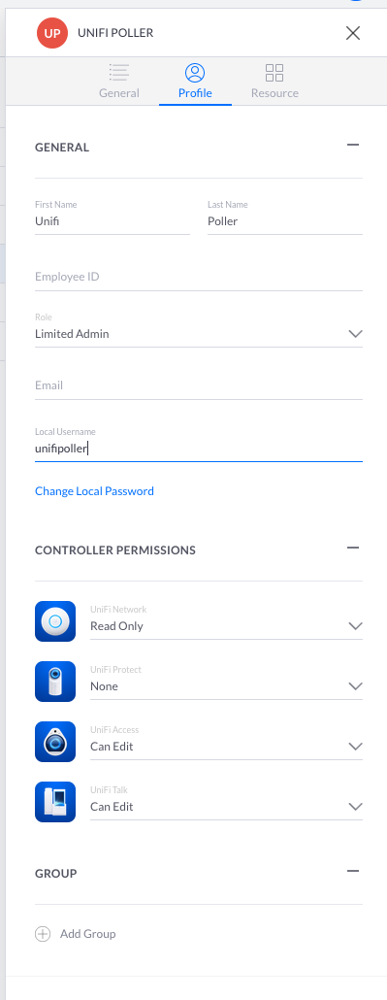

## Where to begin?

The first decision to be made is Docker or not. Many users have chosen to go the Docker route, and it is perhaps worth summarising the pros and cons

#### Advantages of Docker

- Easy to configure, as you can rely on pre-existing work
- Easy to update
- Reliable and well-supported

#### Disadvantages of Docker

- Some performance impact (though not likely to impact UniFi Poller, there is an overhead)
- Relies on a base system for persistence of data
- May not be implemented on some useful platforms (eg NAS)

In the sections below we will first discuss Docker implementation, and then go on to look at implementing the components directly.

In both cases, though, there will be some common configuration steps

The first of these is to set up the controller correctly

## Configuring the controller

The only requirement of the controller is that UniFi Poller can log in to it and extract data. For this purpose go ahead and create a new user now. Make a note of the username and password you have chosen

If your controller is on a UDM or UDM-Pro or UCK running UnifiOS then it is recommended that a Limited Admin user is created with Read-Only rights to the UniFi Network app

For example, here the username chosen is `unifipoller` (which is the default, and one which will be used throughout these docs):

  

If you are using another controller type (eg an older Cloudkey, a VM controller) then just go ahead and create a user

## Next steps

At this point you need to decide whether to use
- [Docker](install_dockercompose.md) - using `docker-compose`
- [Docker](install_docker.md) - using command line (this assumes that you have access to Grafana and InfluxDB/Prometheus)
- Bare metal or a NAS - see the appropriate page (this assumes that you have access to Grafana and InfluxDB/Prometheus)

:::info
Although it is a matter of choice, new users may find it easiest to use `docker_compose`
:::

Finish up by looking at the [Final steps](install_finish.md) page to do the post-install commissioning
