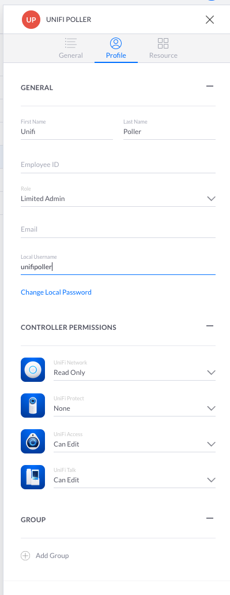

## The Beginning

The first decision to be made is Docker or not. Many users have chosen to go the Docker route.

### Advantages of Docker

- Easy to configure, as you can rely on pre-existing work.
- Easy to update.
- Reliable and well-supported.

### Disadvantages of Docker

- Some performance impact (though not likely to impact UniFi Poller, there is an overhead).
- Relies on a base system for persistence of data.
- May not be implemented on some useful platforms (eg NAS).

In the sections below we will first discuss Docker implementation, and then go on to look
at implementing the components directly. In both cases, though, there will be some common
configuration steps. The first of these is to set up the controller correctly.

## Configuring the controller

The only requirement of the controller is that UniFi Poller can log in to it and extract data.
UniFi Poller supports three login methods: a local controller account, a local controller
API key, or a Remote (Site Manager) API key. See
[Unifi Controller Login](../install/controllerlogin) for a full comparison and setup
instructions for each.

For most users, go ahead and create a new local controller user now. Make a note of the
username and password you have chosen.

If your controller runs UnifiOS (UDM, UDM Pro, UXG, UCG, UCK G2, or self-hosted UnifiOS
Network Server) then it is recommended that a Limited Admin user is created with Read-Only
rights to the UniFi Network app. Other access levels may not work correctly.

For example, the screenshot below shows the username chosen as `unifipoller`.
This is the default, and will be used throughout these docs.

If you are using another controller type (eg. Cloudkey Gen1 or a software controller not
running UnifiOS) then create a read-only user.

If UniFi Poller runs on a different network than your controller (for example, in the
cloud, or a remote site), use the Remote API key method instead - see
[Application Configuration](../install/configuration#remote-api-key).

## Next Steps

:::tip
New users may find `docker-compose` (using **InfluxDB**) easiest to use.
:::

At this point you need to decide whether to use:

1. [Docker](../install/dockercompose) - using Docker Compose.
1. [Docker](../install/docker) - using command line
    - This assumes that you have access to Grafana and InfluxDB/Prometheus.
1. Bare metal or a NAS:
    - Install [Grafana](../dependencies/grafana).
    - Install [InfluxDB](../dependencies/influxdb) or [Prometheus](../dependencies/prometheus).
    - Follow one of these guides: [Linux](linux), [FreeBSD](freebsd), [macOS](macos),
      [Synology](synology), [Windows](windows).
1. An unRAID Template is also available in the Community Applications.
1. You may also install this on a [CloudKey](cloudkey),
    but that's an advanced setup and not generally recommended.
